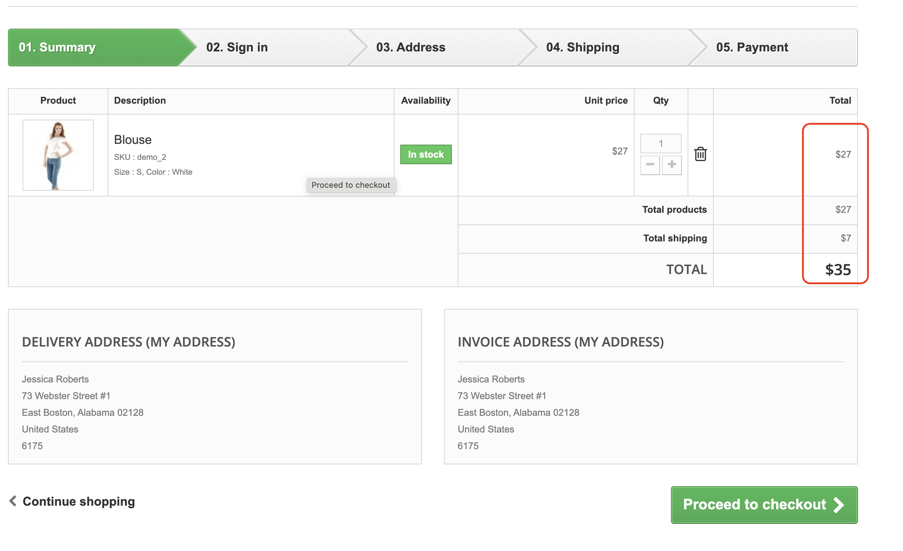
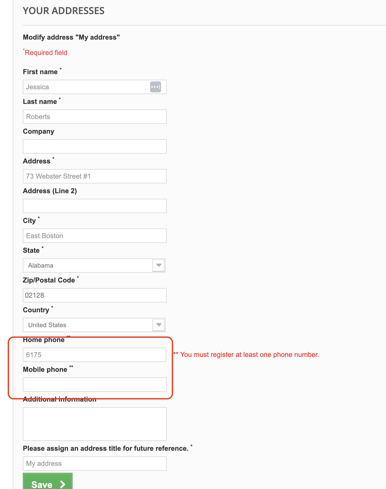
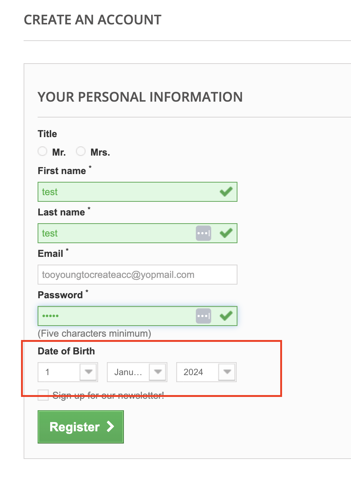

# Bug Report

## Bug 1: Incorrect Total Calculation on Checkout Summary

- **Tested Page**: [http://www.automationpractice.pl/index.php?controller=order]
- **Steps to Reproduce**:
  1. Add the product "Blouse" to the cart.
  2. Proceed to the checkout summary page.
- **Expected Behavior**: The total amount should be the sum of the product price and shipping cost. Since the unit price is $27 and the shipping is $7, the total should be $34.
- **Actual Behavior**: The total displayed on the checkout summary page is $35 instead of $34.
- **Severity**: Major
- **Screenshot**: 

---
## Bug 2: Invalid Phone Number Validation on Address Page

- **Tested Page**: [http://www.automationpractice.pl/index.php?controller=address]
- **Steps to Reproduce**:
  1. Go to the "My Addresses" section and select to modify or add a new address.
  2. Enter an invalid phone number (e.g., "6175" for Home phone) and leave Mobile phone blank.
  3. Click "Save."
- **Expected Behavior**: The form should validate the phone number field to ensure it meets a minimum length and format, displaying an error if it's invalid.
- **Actual Behavior**: The form allows invalid phone numbers (e.g., "6175") without any validation error.
- **Severity**: Medium
- **Screenshot**: 

## Bug 3: Lack of Age Restriction on Account Creation

- **Tested Page**: [http://www.automationpractice.pl/index.php?controller=authentication&back=my-account]
- **Steps to Reproduce**:
  1. Go to the account creation page.
  2. Fill in the registration form with a date of birth that makes the user under 18 years old (e.g., January 1, 2024).
  3. Submit the form by clicking "Register."
- **Expected Behavior**: The system should validate the date of birth to ensure users are at least 18 years old to create an account. If the user is under 18, an error message should be displayed.
- **Actual Behavior**: The form accepts the registration even if the user is under 18, allowing account creation without age restriction.
- **Severity**: Major
- **Screenshot**: 